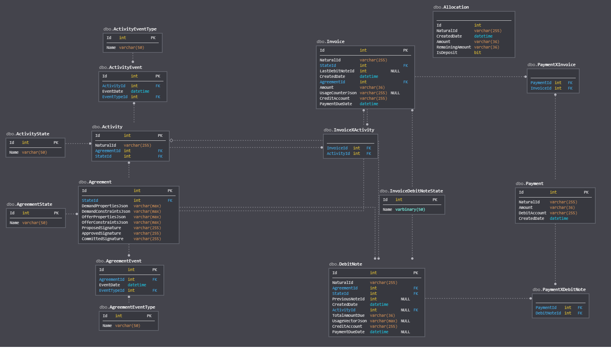

# Yagna persistence db schema

This module is an implementation of Yagna Daemon persistance layer, required to record and maintain the aspects of Daemon funcitonality related to Market, Activity and Payment APIs.

It is based on SQLite3 and Diesel libraries.

## Prerequisites

### Ubuntu

```sh
apt update
apt install curl git build-essential libsql3-dev
curl https://sh.rustup.rs -sSf | sh
source ~/.cargo/env
```

### Windows

Firstly, you will need to install [vcpkg](https://github.com/microsoft/vcpkg):
```
> git clone https://github.com/Microsoft/vcpkg.git
> cd vcpkg
> .\bootstrap-vcpkg.bat
```

Then, set the following environment variable for your account:

```
setx VCPKG_ROOT <path_to_where_you_cloned_vcpkg>
```

After you've done all that, you'll need to install `libsqlite3` using `vcpkg`.
From the dir where you cloned the `vcpkg` into, run:

```
> .\vcpkg install sqlite3 --triplet x64-windows-static
```

Once `sqlib3.lib` is built, set the environment path to point to folder where the .lib file is located:

```
> setx SQLITE3_LIB_DIR <path_to_where_you_cloned_vcpkg>\installed\x64-windows-static\lib

```

### Common

Install Diesel CLI with SQLite:
```
cargo install diesel_cli --no-default-features --features sqlite
```

Run the migration to apply SQL schema to working db file and generate `schema.rs`:
```
diesel migration run
```
It is also possible to re-generate:
```
diesel migration redo
```

For actual execution, the name of db file to be used is controlled via environment variable:
```
DATABASE_URL=yagna.sqlite3
```

## Datamodel




## Market domain

Tables containing entities essential for the Market Protocol negotiations.

### `Agreement`

Table including all the attributes of an Agreement.

| Column                | Type    | Description |
|-----------------------|---------|-----------|
| Id                    | integer | Primary key, autoincrement |
| NaturalId             | varchar(255) | Natural (public) Id of the Agreement |
| StateId               | integer | Foreign key to `AgreementState` |
| DemandNaturalId       | varchar(255) | Natural (public) Id of the Demand which formed the Agreement |
| DemandNodeId          | varchar(255) | Node Id of Demand issuer |
| DemandPropertiesJson  | TEXT    | JSON text specifying Demand Properties |
| DemandConstraintsJson | TEXT    | Demand Constraints criteria expression |
| OfferNaturalId        | varchar(255) | Natural (public) Id of the Offer which formed the Agreement |
| OfferNodeId           | varchar(255) | Node Id of Offer Issuer |
| OfferPropertiesJson   | TEXT    | JSON text specifying Offer Properties |
| OfferConstraintsJson  | TEXT    | Demand Constraints criteria expression |
| ProposedSignature     | TEXT    | Digital signature bitstream (Base64-encoded) of the Agreement artifact serialized after `Confirm()` operation on Requestor side |
| ApprovedSignature     | TEXT    | Digital signature bitstream (Base64-encoded) of the Agreement artifact serialized after `Approve()` operation on Provider side |
| CommittedSignature    | TEXT    | Digital signature bitstream (Base64-encoded) of the Agreement artifact serialized after Approved message is delivered to Requestor side and final commitment is sent to Provider |

### `AgreementEvent`

Table that tracks all events related to the Agreement.

| Column                | Type    | Description |
|-----------------------|---------|-----------|
| Id                    | integer | Primary key, autoincrement |
| AgreementId           | integer | Foreign key to `Agreement` |
| EventDate             | datetime| Event timestamp in UTC |
| EventTypeId           | integer | Foreign key to AgreementEventType |

### `AgreementEventType`

Reference data table indicating available Agreement Event types.

| Column                | Type    | Description |
|-----------------------|---------|-----------|
| Id                    | integer | Primary key, autoincrement |
| Name                  | varchar(50) | Label |

### `AgreementState`

Reference data table indicating available Agreement States.

| Column                | Type    | Description |
|-----------------------|---------|-----------|
| Id                    | integer | Primary key, autoincrement |
| Name                  | varchar(50) | Label |

## Activity domain

Tables containing entities essential for the Activity management and auditing.

### `Activity`

| Column                | Type    | Description |
|-----------------------|---------|-----------|
| Id                    | integer | Primary key, autoincrement |
| NaturalId             | varchar(255) | Natural (public) Id of the Activity |
| AgreementId           | integer | Foreign key to `Agreement` |
| StateId               | integer | Foreign key to `ActivityState` |


### `ActivityEvent`

| Column                | Type    | Description |
|-----------------------|---------|-----------|
| Id                    | integer | Primary key, autoincrement |
| ActivityId            | integer | Foreign key to `Activity` |
| EventDate             | datetime| Event timestamp in UTC |
| EventTypeId           | integer | Foreign key to `ActivityEventType` |


### `ActivityEventType`

Reference data table indicating available Activity Event types.

| Column                | Type    | Description |
|-----------------------|---------|-----------|
| Id                    | integer | Primary key, autoincrement |
| Name                  | varchar(50) | Label |

### `ActivityState`

Reference data table indicating available Activity states.

| Column                | Type    | Description |
|-----------------------|---------|-----------|
| Id                    | integer | Primary key, autoincrement |
| Name                  | varchar(50) | Label |

## Payment domain

Tables containing entities essential for the Payment Protocol execution.

### `Allocation`

| Column                | Type    | Description |
|-----------------------|---------|-----------|
| Id                    | integer | Primary key, autoincrement |
| NaturalId             | varchar(255) | Natural (public) Id of the Allocation |
| CreatedDate           | datetime | Allocation creation timestamp in UTC |
| Amount                | varchar(36) | Maximum Allocation amount |
| RemainingAmount       | varchar(36) | Amount remaining in allocation (after all deduction operations) |
| IsDeposit             | char(1) | Indicates if the Allocation has been also transferred into relevant Deposit account (for Payment Platforms which leverage Deposits) |


### `DebitNote`

| Column                | Type    | Description |
|-----------------------|---------|-----------|
| Id                    | integer | Primary key, autoincrement |
| NaturalId             | varchar(255) | Natural (public) Id of the Debit Note |
| AgreementId           | integer | Foreign key to `Agreement` |
| StateId               | integer | Foreign key to `InvoiceDebitNoteState` |
| PreviousNoteId        | integer | Foreign key to self |
| CreatedDate           | datetime | Debit Note creation timestamp (in UTC) |
| ActivityId            | integer | Foreign key to `Activity` |
| TotalAmountDue        | varchar(36) | Total owed amount owed accrued by the Activity |
| UsageCounterJson       | TEXT | JSON representation of the Activity's usage counters vector at the time of Debit Note issue |
| CreditAccount         | varchar(255) | The target account to which payment should be made |
| PaymentDueDate        | datetime | The timestamp (in UTC) by which the payment is expected to arrive |

### `Invoice`

| Column                | Type    | Description |
|-----------------------|---------|-----------|
| Id                    | integer | Primary key, autoincrement |
| NaturalId             | varchar(255) | Natural (public) Id of the Invoice |
| StateId               | integer | Foreign key to `InvoiceDebitNoteState` |
| LastDebitNoteId       | integer | Foreign key to `DebitNote` |
| CreatedDate           | datetime | Invoice creation timestamp (in UTC) |
| AgreementId           | integer | Foreign key to `Agreement` |
| Amount                | varchar(36) | Total owed amount owed accrued by the Agreement |
| UsageCounterJson      | varchar(255) |  JSON representation of the Agreement's usage counters vector which is a base for the Invoice amount |
| CreditAccount         | varchar(255) | The target account to which payment should be made |
| PaymentDueDate        | datetime | The timestamp (in UTC) by which the payment is expected to arrive |

### `InvoiceDebitNoteState`

| Column                | Type    | Description |
|-----------------------|---------|-----------|
| Id                    | integer | Primary key, autoincrement |
| Name                  | varchar(50) | Label |

### `InvoiceXActivity`

Association table between Invoice and Activity.

| Column                | Type    | Description |
|-----------------------|---------|-----------|
| Id                    | integer | Primary key, autoincrement |
| InvoiceId             | integer | Foreign key to `Invoice` |
| ActivityId            | integer | Foreign key to `Activity` |

### `Payment`

| Column                | Type    | Description |
|-----------------------|---------|-----------|
| Id                    | integer | Primary key, autoincrement |
| NaturalId             | varchar(255) | Natural (public) Id of the Payment |
| Amount                | varchar(36) | Payment Amount |
| DebitAccount          | varchar(255) | Account from which the payment has been made |
| CreatedDate           | datetime | Payment timestamp (in UTC) |

### `PaymentXDebitNote`

Association table between Payment and DebitNote.

| Column                | Type    | Description |
|-----------------------|---------|-----------|
| Id                    | integer | Primary key, autoincrement |
| PaymentId             | integer | Foreign key to `Payment` |
| DebitNoteId           | integer | Foreign key to `DebitNote` |

### `PaymentXInvoice`

Association table between Payment and Invoice.

| Column                | Type    | Description |
|-----------------------|---------|-----------|
| Id                    | integer | Primary key, autoincrement |
| PaymentId             | integer | Foreign key to `Payment` |
| InvoiceId             | integer | Foreign key to `Invoice` |
