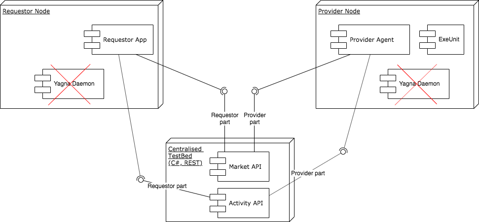

# Centralised (Mk0) Yagna Market

First incarnation (Mk0) of Yagna Market component was centralized.
Single Server was handling all the traffic on the market.
It was created to enable prototyping of two Agents: ya-provider and ya-requestor (discontinued at 2021.01.14).

Yagna Market service Mk0 was finally integrated with Yagna Daemon
as proxy to the central instance. It is not supported anymore.

 

