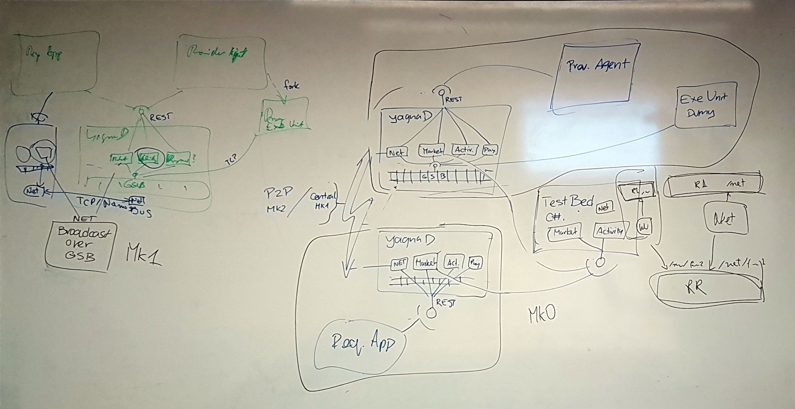

# Broadcasted P2P (Mk1) Yagna Market

Second iteration of Yagna Market component will integrated with Yagna Daemon via service bus and written in RUST.

It will utilise simplistic Yagna Net implementation which will enable full broadcast within Yagna network.

This situation is scratched on the left below.

 
