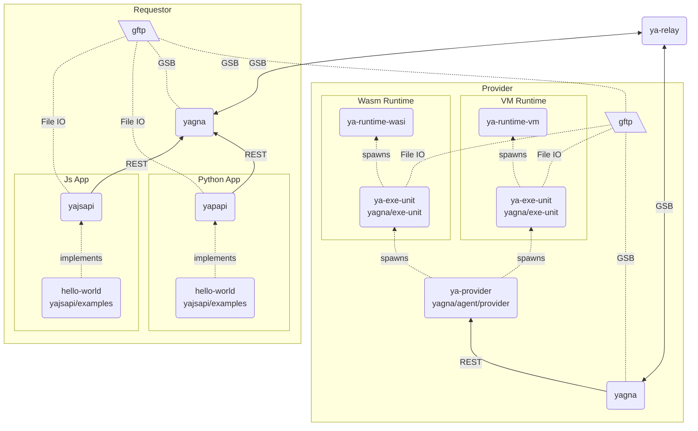

# Hybrid network dev setup

## Local network graph

```mermaid
flowchart BT
    relay(ya-relay)

    y_p <-->|GSB| relay
    y_r <-->|GSB| relay
    gftp_p -.-|GSB| gftp_r

    subgraph Requestor
        y_r(yagna)
        gftp_r[\gftp\]
        
        y_r -.-|GSB| gftp_r
        py_api(yapapi) -->|REST| y_r
        js_api(yajsapi) -->|REST| y_r
        py_api -.-|File IO| gftp_r
        js_api -.-|File IO| gftp_r

        subgraph Js App
            js_hello(hello-world \n yajsapi/examples)
            js_api(yajsapi)

            js_hello -.->|implements| js_api
        end

        subgraph Python App
            py_hello(hello-world \n yajsapi/examples)
            py_api(yapapi)
            
            py_hello -.->|implements| py_api
        end
    end

    subgraph Provider
        y_p(yagna)
        prov(ya-provider \nyagna/agent/provider)
        gftp_p[\gftp\]

        y_p -->|REST| prov
        y_p -.-|GSB| gftp_p
        prov -.->|spawns| exe_vm
        prov -.->|spawns| exe_wasi
        exe_vm -.-|File IO| gftp_p
        exe_wasi -.-|File IO| gftp_p

        subgraph VM Runtime
            exe_vm(ya-exe-unit \n yagna/exe-unit) 
            vm(ya-runtime-vm)

            exe_vm -.->|spawns| vm
        end

        subgraph Wasm Runtime
            exe_wasi(ya-exe-unit \n yagna/exe-unit)
            wasi(ya-runtime-wasi)

            exe_wasi -.->|spawns| wasi
        end
    end
```
