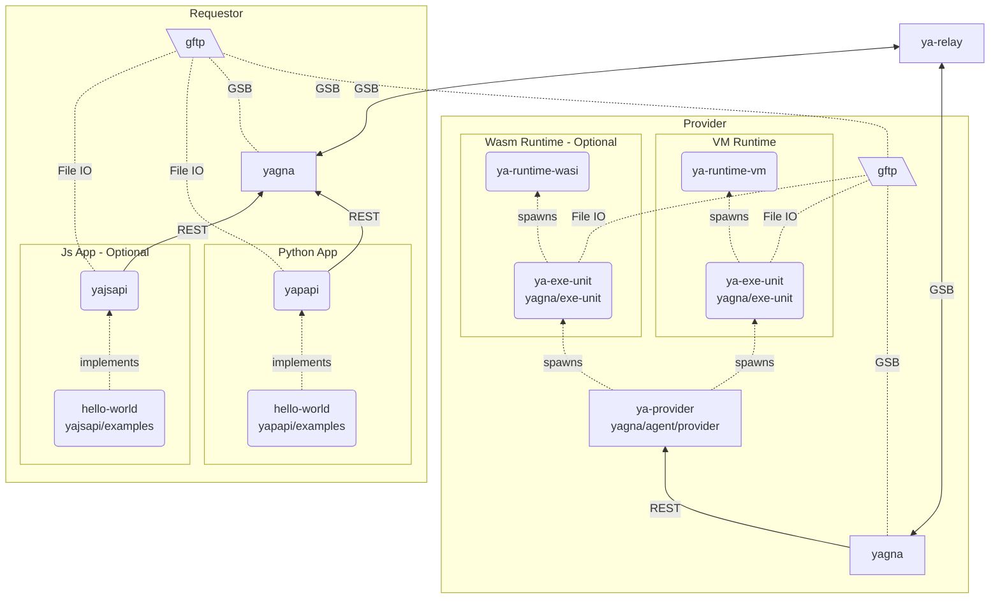

# Hybrid network dev setup

## Local network setup diagram



## Setup

### Prerequisites

- Linux - Only VM runtime is actively maintained and it requires Linux. It works on WSL.
- rust
- Python 3.x (and preferably [Poetry](https://python-poetry.org/docs/#installation))
- NodeJS [Optional]

Additional packages:

```bash
sudo apt install  build-essential libprotobuf-dev protobuf-compiler
```

### Projects checkout

Clone projects into workspace directory:

```sh
git clone git@github.com:golemfactory/yagna.git
git clone git@github.com:golemfactory/ya-relay.git
git clone git@github.com:golemfactory/yapapi.git
git clone git@git@github.com:golemfactory/yajsapi.git
git clone git@github.com:golemfactory/ya-runtime-wasi.git
# It is worth to have sources, but this guide will use binaries of VM runtime
git clone git@github.com:golemfactory/ya-runtime-vm.git
```

### Building projects

```sh
# Build yagna (project contains ya-provider, exe-unit, and gftp)
cd yagna;
cargo build --all;
cargo install --path core/gftp --features bin
cd -;

# Build ya-relay
cd ya-relay;
cargo build;
cd -;

# Download ya-runtime-vm binaries
wget -q $(curl -s https://api.github.com/repos/golemfactory/ya-runtime-vm/releases/latest | grep browser_download_url | grep "linux" | cut -d '"' -f 4);
mkdir ya-runtime-vm_bin;
tar -xzf $(ls ya-runtime-vm-linux-*.tar.gz) --strip-components 1 --directory ya-runtime-vm_bin

# Build ya-runtime-wasi
cd ya-runtime-wasi;
cargo build;
cd -;
```

### Configuring Requestor and Provider

#### Requestor

```sh
mkdir ya-req_hybrid;
cp .env-template ya-req_hybrid/.env

sed -e "s/__YOUR_NODE_NAME_GOES_HERE__/$USER_requestor/" .env
sed -e "s/__NET_TYPE__/hybrid/" .env

tee -a ya-req_hybrid/.env << END
RUST_LOG=debug,tokio_core=info,tokio_reactor=info,hyper=info,reqwest=info
GSB_URL=tcp://127.0.0.1:12501
YAGNA_API_URL=http://127.0.0.1:12502
YA_NET_BIND_URL=udp://0.0.0.0:12502
YA_NET_RELAY_HOST=127.0.0.1:7464
END
```

Start [yagna service](../core/serv/README.md):

```sh
cd ya-req_hybrid;
cargo run service run
```

Then generate `YAGNA_APPKEY` for requestor.

```sh
cd ya-req_hybrid;
APP_KEY=`cargo run app-key create 'requestor'`
sed -e "s/__GENERATED_APP_KEY__/$APP_KEY/" .env
```

#### Provider

```sh
mkdir ya-prov_hybrid;
cp .env-template ya-prov_hybrid/.env

sed -e "s/__YOUR_NODE_NAME_GOES_HERE__/$USER_provider/" .env
sed -e "s/__NET_TYPE__/hybrid/" .env

tee -a ya-req_hybrid/.env << END
RUST_LOG=debug,tokio_core=info,tokio_reactor=info,hyper=info,reqwest=info
RUST)bACKTRACE=1
MEAN_CYCLIC_BCAST_INTERVAL="1s"
GSB_URL=tcp://127.0.0.1:11501
YAGNA_API_URL=http://127.0.0.1:11502
YA_NET_RELAY_HOST=127.0.0.1:7464
END
```
