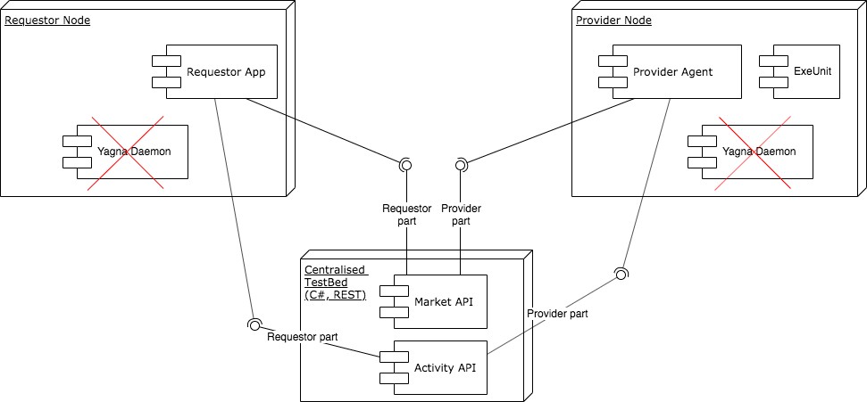

# Centralised (Mk0) Yagna Market

First incarnation (Mk0) of Yagna Market component is centralized.
Single Server will handle all the traffic on the market.
It is created to enable prototyping of two actors that are using
Market API - namely: Provider Agent and Requestor App.

Centralized Market Server implementation for Mk0 is described [here](
../../test-utils/market-hub/README.md
).

It serves REST API conforming with Cabability Level 1 of the 
[Market API specification](
https://docs.google.com/document/d/1Zny_vfgWV-hcsKS7P-Kdr3Fb0dwfl-6T_cYKVQ9mkNg/edit#heading=h.8anq3nlk2en7
) which means support for the three basic phases of the market interaction:
[Discovery](#discovery-phase), [Negotiation](#negotiation-phase) and [Agreement](#agreement-phase).

In Mk0 we will provide [client library crate](https://github.com/golemfactory/ya-client)
with typesafe bindings to Market API.
It will be valid for all MkX, because API itself will be the same.

Yagna Market service Mk0 will **not** be integrated with Yagna Daemon, nor service bus.
It is not needed since its Market Mk0 implementation already supports also Activity (Mk0)
and so both prototyped actors need to connect to a single service (REST).
Provider Agent will need to connect also to ExeUnit (it can be done via service bus
or directly via ExeUnit CLI). 

 

## Yagna Market

The Yagna Market is a core component of the Yagna Network, which enables computational Offers
and Demands circulation. The Market is open for all entities willing to buy computations (Demands)
or monetize computational resources (Offers).

## Yagna Market API

The Yagna Market API is the entry to the Yagna Market through which Requestors and Providers 
can publish their Demands and Offers respectively, find matching counterparty, conduct negotiations
and make an agreement.

Each of the two roles: Requestors and Providers have their own interface in the Market API.

## Market Interaction

Market interaction is divided into tree phases described below.

In target solution (Mk2) the Negotiation and Agreement phases will involve direct one-to-one
communication, but for Mk0 the central server will be an intermediary here.

### Discovery Phase
Users are joining the Yagna Network by publishing their Offers or Demands.
Yagna Market is [matching incoming Demands and Offers](
https://docs.google.com/document/d/1yTupuRsN9DKVrK1TPhM6dBxKCAPk0wCB8KxRf57ZkV4
) and creates Proposals. Proposal is a pair of Offer and Demand which are matching.
The matching can be [strong or weak](
https://docs.google.com/document/d/1tzMrhdBr9wiUXtSn1JO18MmIiP31dkMakdjStnF3eZY/edit#heading=h.jzr5wr9i4uh5
). Each Proposal is fed to both issuers (parties) of its components.

### Negotiation Phase
Upon Proposal reception a party (usually the Requestor) can start interaction with selected
counterparty to negotiate the Proposal. During the negotiation parties are alternately
exchanging Proposals with adjusted properties or/and constraints for owned component
to strongly match Offer with Demand.

The Mk0 Market implementation will **not** support [dynamic property resolution nor
pseudo-function support](
https://docs.google.com/document/d/1Zny_vfgWV-hcsKS7P-Kdr3Fb0dwfl-6T_cYKVQ9mkNg/edit#heading=h.6y5qk7bcl9qy
) during the Negotiation phase.

### Agreement Phase
The negotiation is successful when the Requestor receives a Proposal with an Offer satisfying
all constrains from his Demand (strong match). The Requestor can promote such a Proposal
into an Agreement. The Agreement is send to Provider to be finally accepted.

Provider acceptance finishes the Market interaction for both parties and enables Requestor
to start an Activity.
