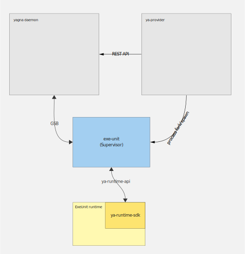

# Provider architecture

Golem's architecture is based on a modular design with the aim of providing decoupled and
replaceable components. The primary building block is the Provider Agent application (ya-provider),
which can be extended using pluggable ExeUnits.

ExeUnits are responsible for executing Requestors' code. Although conceptually similar to
virtual machines, ExeUnits offer a broader range of utility.

## Interactions

Provider application consists of following components:

- Yagna daemon: It serves as the entry point to the Golem Network, providing APIs for communication
  between Nodes, handling market interactions, executing computations, and managing payments.
  It exposes a REST API for agent applications.
- Provider agent: This component is responsible for implementing the provider's business logic.
  It handles negotiation of Agreements on the market, spawns ExeUnits, and manages invoicing
  and payment reception.
- ExeUnit Supervisor: The ExeUnit Supervisor controls the ExeUnit Runtime and facilitates
  communication with the Yagna daemon.
- ExeUnit Runtime: This component is the implementation-specific part of the execution environment.

<!-- Image source (private): https://miro.com/app/board/o9J_lFQXrEc=/ -->

### Communication

| From               | To                 | Protocol                                           |
| ------------------ | ------------------ |----------------------------------------------------|
| Provider Agent     | Yagna daemon       | REST API                                           |
| Provider Agent     | ExeUnit Supervisor | No communication (process is only spawned)         |
| Yagna daemon       | ExeUnit Supervisor | GSB (Unix socket / TCP depending on configuration) |
| ExeUnit Supervisor | ExeUnit Runtime    | Unix socket, UDP or TCP (UDP by default)           |

There are 3 communication channels between ExeUnit Supervisor and Runtime:
- Status and stdout/stderr channel output
- Outbound networking
- VPN traffic
